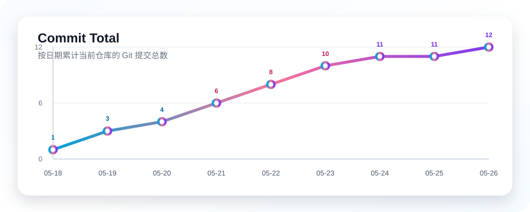
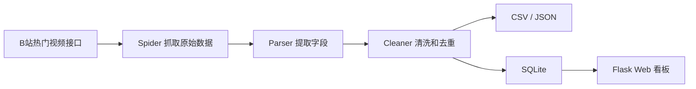

# Bilibili 热门视频数据抓取项目

> 一个用于学习 Python 数据工程的小项目：抓取 B站热门视频，清洗成结构化数据，保存到 CSV、JSON 和 SQLite，并用 Flask 做本地数据看板。

`Python` `Pandas` `SQLite` `Flask` `ECharts` `Data Pipeline`

## 项目亮点

- 抓取 B站热门视频列表，并保留原始 JSON，方便以后复查数据来源。
- 用 `pandas` 清洗视频数据，过滤异常播放量，并按 `bvid` 去重。
- 同时保存 CSV、JSON 和 SQLite，适合练习不同数据存储方式。
- SQLite 中把视频基础信息和变化指标拆开：主表保存稳定字段，快照表保存播放量、点赞数等随时间变化的数据。
- 提供本地 Flask 看板，可以查看视频列表、分区统计和图表。

## 提交节奏



统计口径：使用当前仓库的 `git log --date=short --pretty=format:%ad`，先按日期聚合每日提交次数，再从最早日期开始计算累计总数。

## 数据流程



## 项目结构

```text
dynamicData/
├── assets/
│   └── commit_activity.svg       # README 中的提交次数折线图
├── bilibiliapi/
│   ├── __main__.py               # 支持 python -m bilibiliapi 运行
│   ├── main.py                   # 主流程入口：抓取、解析、清洗、保存
│   ├── database.py               # SQLite 连接配置
│   ├── core/
│   │   └── fetcher.py            # 通用请求和配置读取
│   ├── spiders/
│   │   └── popular_spider.py     # 热门视频和在线人数接口抓取
│   ├── pipelines/
│   │   ├── parser.py             # 从原始 JSON 提取字段
│   │   ├── cleaner.py            # 数据清洗
│   │   └── saver.py              # 保存 CSV、JSON、SQLite
│   ├── analysis/
│   │   ├── category.py           # 分区统计分析
│   │   └── metrics.py            # 互动率等指标计算
│   └── web/
│       ├── app.py                # Flask Web/API 入口
│       ├── db.py                 # SQLite 查询函数
│       ├── static/               # CSS 和前端 JS
│       └── templates/            # HTML 模板
├── settings.yaml                 # 项目配置
├── requirements.txt              # Python 依赖
└── README.md
```

## 运行后生成的数据

```text
data/
├── raw_popular.json
└── cleaned/
    ├── bilibili_popular.csv
    ├── bilibili_popular.json
    └── bilibili_data.db
```

SQLite 里主要有两张表：

- `popular_videos`：每个 `bvid` 一条记录，保存标题、UP主、分区、发布时间、链接、封面、时长等相对稳定的信息。
- `popular_video_snapshots`：每次抓取都会写入一条快照，保存播放量、弹幕数、点赞数、投币数、收藏数和抓取时间。

## 环境准备

建议使用虚拟环境：

```powershell
python -m venv .venv
.\.venv\Scripts\activate
pip install -r requirements.txt
```

## 运行爬虫

在项目根目录执行：

```powershell
python -m bilibiliapi
```

这个命令会完成三件事：

1. 请求 B站热门视频接口。
2. 提取视频标题、UP主、播放量、发布时间等字段。
3. 保存到 `data/cleaned/` 目录。

爬虫参数在 `settings.yaml` 中配置：

```yaml
spider:
  max_items: 1000
  max_pages: 100
  page_size: 20
```

## 检查数据库

爬虫运行成功后，可以简单查看 SQLite 中有哪些表：

```powershell
python -c "import sqlite3; conn=sqlite3.connect('data/cleaned/bilibili_data.db'); print(conn.execute('SELECT name FROM sqlite_master').fetchall())"
```

如果提示数据库不存在，先运行：

```powershell
python -m bilibiliapi
```

## 启动 Web 看板

先确认已经生成数据库，然后运行：

```powershell
python -m bilibiliapi.web.app
```

浏览器访问：

```text
http://127.0.0.1:5000/
http://127.0.0.1:5000/api/videos
```

`/api/videos` 会返回 SQLite 中的热门视频 JSON 数据；页面首页会展示热门视频、分区概览和图表。

## 常见问题

如果运行时提示 `ModuleNotFoundError`，通常是因为没有安装依赖或没有在项目根目录运行。先确认已经执行：

```powershell
pip install -r requirements.txt
```

如果 `/api/videos` 返回空列表，通常是因为还没有生成数据库。先运行：

```powershell
python -m bilibiliapi
```

如果抓取失败，先检查网络是否能访问 B站接口，并降低请求量。这个项目只做普通学习用途，不做高频请求。
